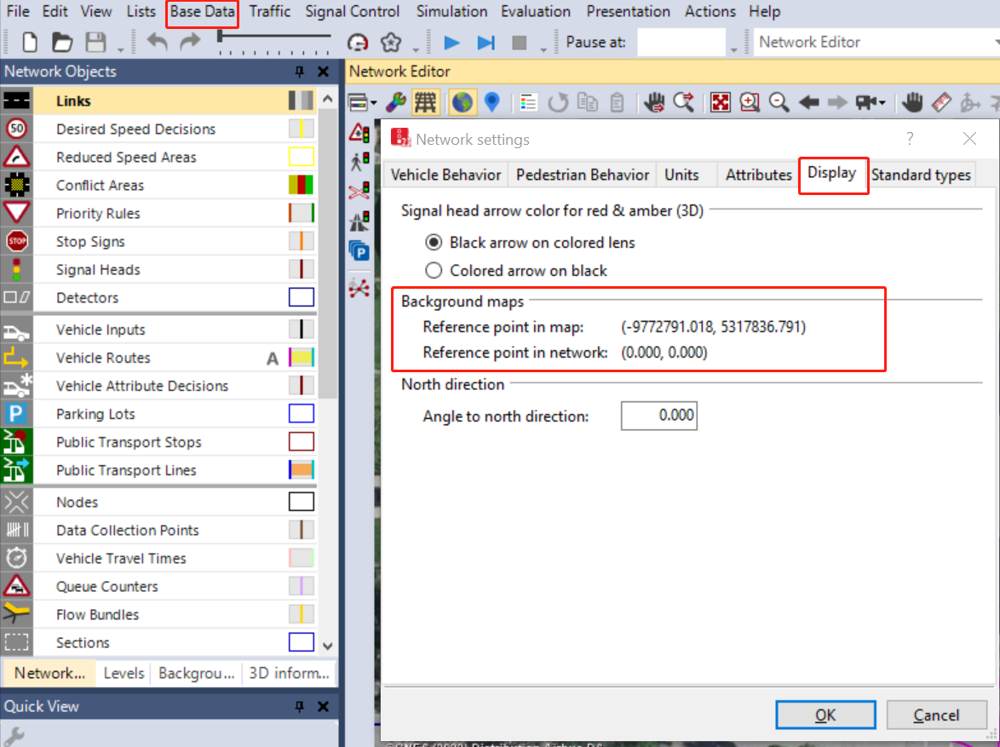

# vissim2wgs1984

Convert vissim files (.inpx and .fzp to geojson, .fhz to csv).

This tool help user convert vissim files to wgs1984 and csv files.

specifically,

1. convert **.inpx** to .geojson file
2. convert **.fzp** file to .geojson and csv files.  comment: will return two files, one is geojson file and anther is csv file.
3. convert **.fhz** file to csv file.

## Need to know before using this tool

1. **Vissim Simulation**
   This tool is to conver files geneated by PTV Vissim. You design you own network or get network from other sources.

   You will get the layer file (.inpx). the .inpx can only open by PTV Vissim and you can use this tool to convert layer file to wgs1984 so that you can see your layer at different platform (QGIS, Kepler.gl, ArcMap...)

   You will get simulation results (.fzp and .fhz). you can open these files by PTV Vissim but you can not other platform. you can use this tool to convert .fzp file to (.geojson and .csv),  .fhz file to .geojson.
2. **Prepare data for this tool**

   In order to use this tool , you need to prepare several data for the map conversion.

   There are for digital nubmers from Background maps:

   Everytime you are using PTV Vissim, the software will generate these nubmers at Base Data -> Network settings -> Display

   **Reference point in map**: (-9772791.018, 5317836.791)                  you will need to replace these numbers by yours

   **Reference point in network**: (0.000, 0.000)                                     you will need to replace these numbers by yours

   

## How to use the tool

1. install from pypi
   `pip install vissim2geojson`
2. dependencies

   ```
   Fiona==1.8.13.post1
   geojson==2.5.0
   geopandas==0.9.0
   pandas==1.4.2
   Shapely==1.7.1
   ```
3. use case

   Sample user case at intersection
   

   ```
   import  vissim2geojson

   if__name__=="main":

       file_inpx ="./vissim_data/xl_002.inpx"
       file_fhz ="./vissim_data/xl_002_001.fhz"
       file_fzp ="./vissim_data/xl_002_001.fzp"
       file_folder ="./vissim_data"

       # prepare map reference info from Vissim
       x_refmap =-9772791.018
       y_refmap =5317836.791

       x_refnet =0
       y_refnet =0

       # for covert fzp files, if you don't need to convert fzp file, leave these value to default values.
       x_col_name ="POS"
       y_col_name ="POSLAT"

       # using vissim folder as input path, will generate four files: inpx.geojson, fzp.geojson, fzp.csv, fhz.csv.
       # all result files will save to the same folder as the input folder.

       vissim2wgs1984(file_folder, x_refmap, y_refmap, x_refnet, y_refnet, x_col_name, y_col_name).main()

   ```

Enjoy it!
